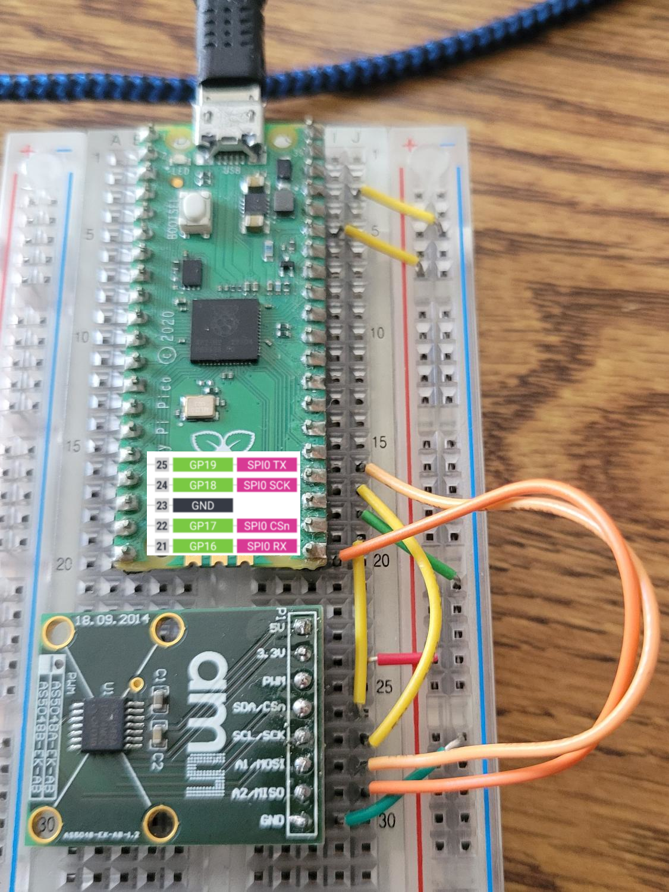

# pico_and_ams5048a
A diagnostic tool for the AMS5048A magnetic rotation position sensor. This is meant to be a minimal viable product project to test the sensistivity of the AMS5048A for particular applications. It is missing:
[ ] Limit switch zero
[ ] Advanced Diagnostics
[ ] Direct Memory Acess (DMA) embedded C version

This is clunky and in python. Python is slow. C would be better, but this is just a little test.

## Hardware Connections




# AS5048A to Raspberry Pi Pico Pinout

| AS5048A Pin       | Raspberry Pi Pico Pin      | Description                                                                 |
|-------------------|----------------------------|-----------------------------------------------------------------------------|
| VCC               | 3.3V (Pin 36)             | Power supply (sensor is 3.3V–5V tolerant; connect to 3.3V for logic compatibility) |
| GND               | GND (e.g., Pin 38)        | Ground                                                                      |
| SCK (CLK)         | GP18 (SPI0 SCK)           | SPI clock signal                                                            |
| MISO (DO)         | GP16 (SPI0 RX)            | Master In Slave Out – data output from the AS5048A sensor to the Pico        |
| MOSI (DI)         | GP19 (SPI0 TX)            | Master Out Slave In – command/data input to the AS5048A sensor from the Pico |
| CS                | GP17 (any GPIO)           | Chip Select (active low) – used to select the sensor on the SPI bus         |
| PROG (optional)   | Not needed                | Programming pin for firmware updates; leave floating/unconnected for normal operation |


AS5048A PinRaspberry Pi Pico PinDescriptionVCC3.3V (Pin 36)Power (3.3V-5V tolerant)GNDGND (e.g., Pin 38)GroundSCK (CLK)GP18 (SPI0 SCK)ClockMISO (DO)GP16 (SPI0 RX)Master In Slave Out (data from sensor)MOSI (DI)GP19 (SPI0 TX)Master Out Slave In (commands to sensor)CSGP17 (any GPIO)Chip Select (active low)PROG (optional)Not neededFor programming, leave floating

## Software Development - Thonny

### Windows Install
https://thonny.org/

### Linux (Ubuntu/Debian) Install
```bash
apt install thonny
```

